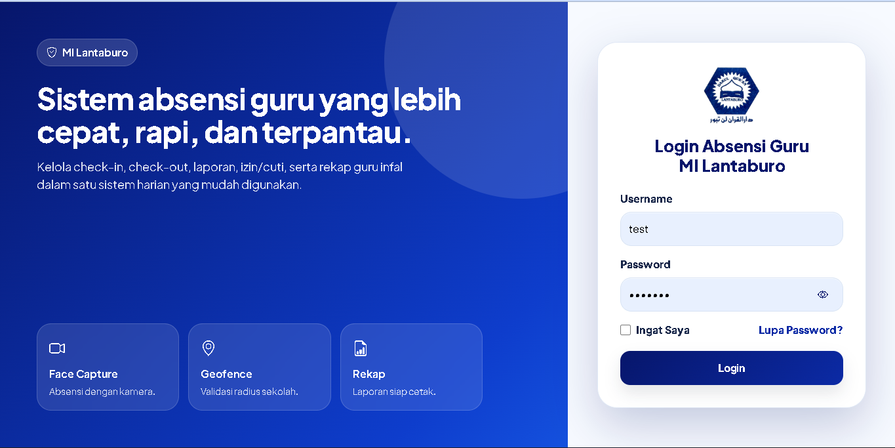
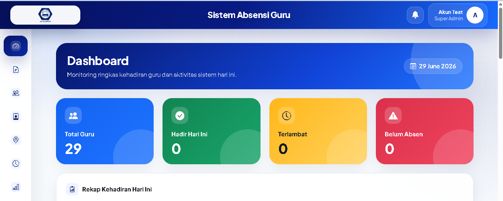
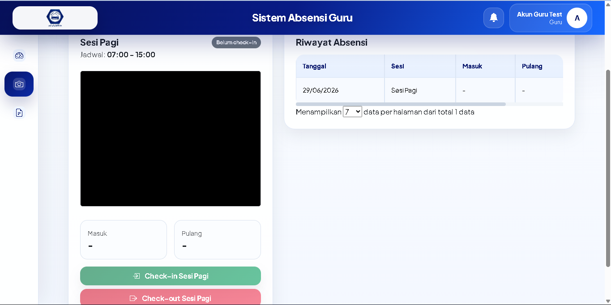
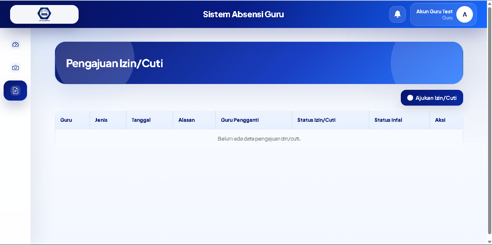
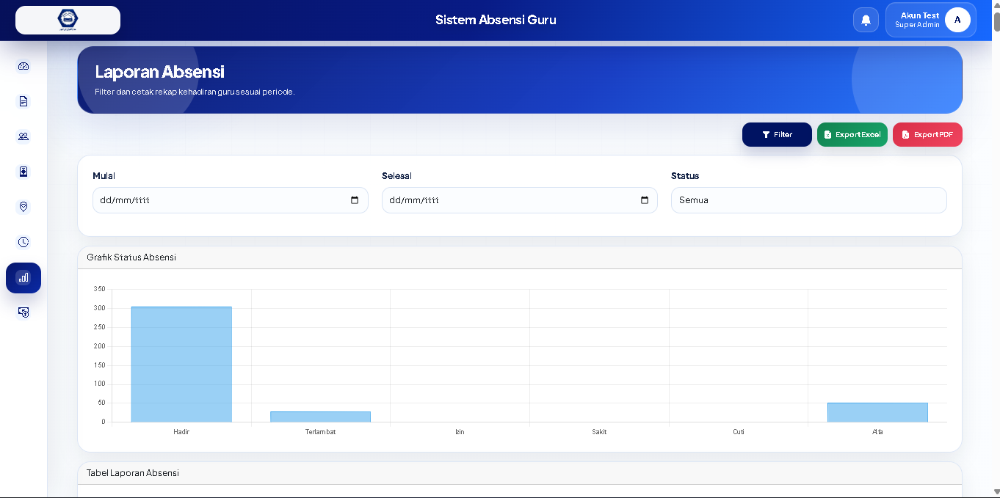

# Sistem Absensi Guru Berbasis Web

> Dokumentasi portofolio. Repository ini tidak memuat source code, database, kredensial, maupun data operasional.

## Ringkasan Proyek

Sistem berbasis web untuk membantu institusi pendidikan mengelola kehadiran guru secara lebih tertib, terdokumentasi, dan mudah dipantau. Aplikasi dirancang untuk mendukung proses absensi harian, pengajuan ketidakhadiran, persetujuan administratif, serta rekap laporan.

## Fitur Utama

- Autentikasi pengguna berbasis peran: guru, admin, kepala sekolah, dan super admin.
- Check-in dan check-out kehadiran.
- Validasi lokasi berbasis geofencing sekolah.
- Pengambilan foto melalui kamera perangkat sebagai bukti kehadiran.
- Pengajuan izin, sakit, cuti, dan tugas luar.
- Persetujuan pengajuan oleh pihak berwenang.
- Manajemen sesi/jadwal absensi.
- Dashboard monitoring dan rekap kehadiran.
- Rekap serta ekspor laporan ke Excel dan PDF.
- Pengelolaan komponen penggajian dan periode payroll.

## Teknologi yang Digunakan

- Laravel 12
- PHP 8.2+
- MySQL / MariaDB
- Bootstrap 5
- JavaScript
- Laravel Excel
- DOMPDF

## Peran dan Kontribusi

- Merancang alur kerja absensi dan pengajuan ketidakhadiran.
- Mengembangkan fitur backend, manajemen data, dan kontrol akses pengguna.
- Membuat antarmuka administrasi serta halaman guru.
- Mengimplementasikan rekap, ekspor laporan, dan pengelolaan payroll.
- Menyiapkan validasi lokasi dan dokumentasi foto sebagai pendukung audit kehadiran.

## Tampilan Aplikasi

Tambahkan screenshot menggunakan data simulasi dan nama file berikut:

| Tampilan | Nama file |
| --- | --- |
| Halaman login | `assets/01-login.png` |
| Dashboard | `assets/02-dashboard.png` |
| Halaman absensi | `assets/03-absensi.png` |
| Pengajuan izin | `assets/04-pengajuan-izin.png` |
| Rekap / laporan | `assets/05-laporan.png` |

> Jangan gunakan screenshot yang memuat wajah, NIP, nomor telepon, lokasi detail, tanda tangan, atau data kehadiran asli.

### Halaman Login

### Dashboard

### Halaman Absensi

### Pengajuan Izin

### Rekap dan Laporan Absensi

## Status Source Code

Source code bersifat privat untuk menjaga keamanan sistem, kerahasiaan data, dan hak pengembangan proyek. Materi pada repository ini hanya digunakan sebagai dokumentasi portofolio.

## Hak Cipta

© 2026 [tarodev]. Seluruh hak cipta dilindungi.
